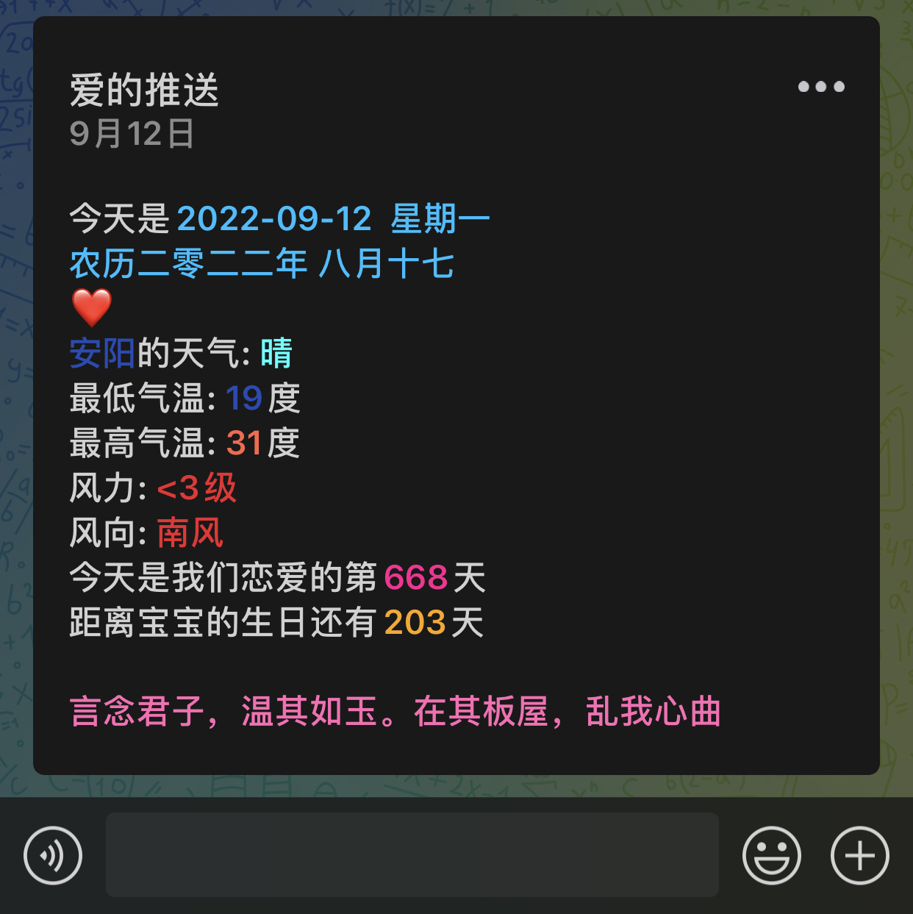
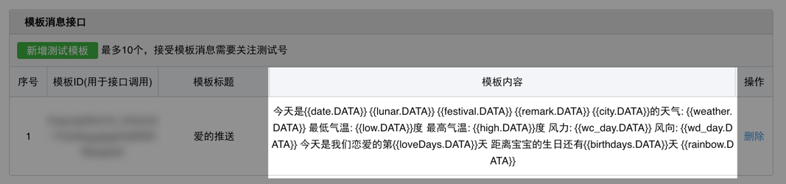
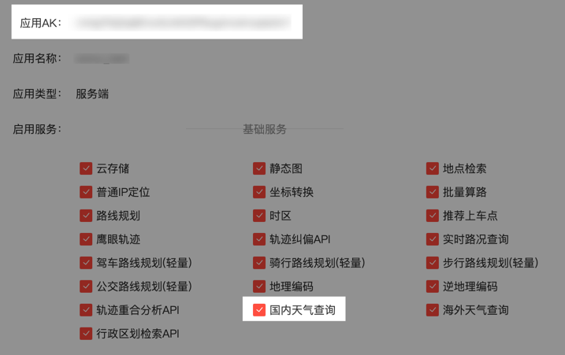
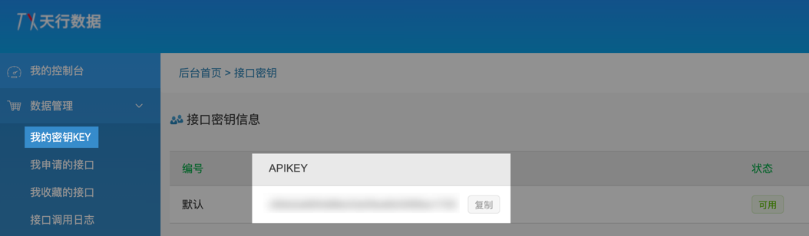

# wechat-push
基于 `springboot` 实现微信公众号消息推送

## 项目效果


## 已实现功能
- [X] 获取天气信息
- [X] 获取彩虹屁数据
- [X] 定时任务推送
- [X] 单人推送
- [X] 多人推送

## 相关配置

### 微信公众平台账号配置
1. [点此注册微信公众平台测试账号](https://mp.weixin.qq.com/debug/cgi-bin/sandboxinfo?action=showinfo&t=sandbox/index) ，用于公众号消息推送
2. 将对应的 `appID`、`appsecret` 、 `微信号(openid)` 、 `消息模板ID` 填写在 `application.yml` 配置文件中
3. 进行消息模板配置
    ```
    今天是{{date.DATA}}
    {{lunar.DATA}} {{festival.DATA}}
    {{remark.DATA}}
    {{city.DATA}}的天气: {{weather.DATA}}
    最低气温: {{low.DATA}}度
    最高气温: {{high.DATA}}度
    风力: {{wc_day.DATA}}
    风向: {{wd_day.DATA}}
    今天是我们恋爱的第{{loveDays.DATA}}天
    距离宝宝的生日还有{{birthdays.DATA}}天
    {{rainbow.DATA}}
    ```
   


### 百度开放平台配置
1. [百度天气接口文档](https://lbs.baidu.com/index.php?title=webapi/weather)
2. [百度开放平台控制台地址](https://lbs.baidu.com/apiconsole/key#/home) ，创建应用并将 `应用AK` 填写在 `application.yml` 配置文件中
    
3. 城市对应的行政区划ID可在[服务文档](https://lbs.baidu.com/index.php?title=webapi/weather) 的请求参数中的 `district_id` 一栏下载 “**行政区划编码**” 查看

### 天行数据平台配置
1. [彩虹屁接口文档](https://www.tianapi.com/apiview/181)
2. 申请接口权限
3. 将天行 `apikey` 填写在 `application.yml` 配置文件中


## 运行

**将 `application.yml` 配置文件填写完毕后直接启动运行项目即可，修改定时任务时间在 `PushTask.java` 中进行修改** 