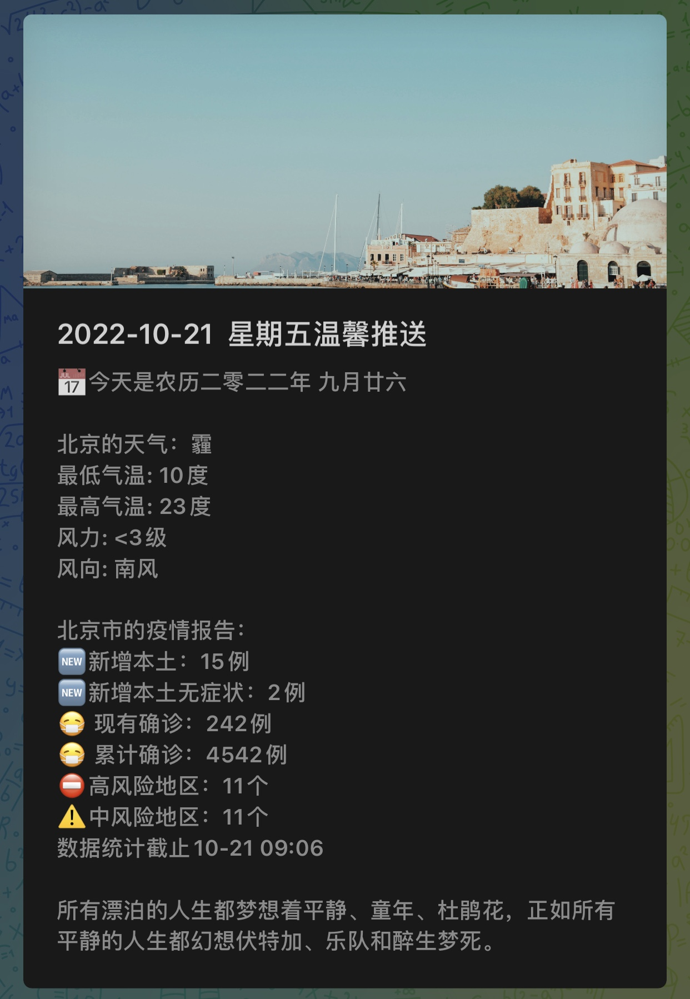

# wechat-push
基于 `springboot` 实现微信公众号、企业微信消息推送

## 项目效果
#### 公众号模板消息效果


#### 企业微信图文消息效果


## 已实现功能
- [X] 获取天气信息
- [X] 获取彩虹屁数据
- [X] 获取必应每日壁纸图片
- [X] 获取one一个图片及文案
- [X] 获取COVID-19相关数据
- [X] 定时任务推送
- [X] 单人推送
- [X] 多人推送
- [X] 企业微信单图文推送

## 相关配置

### 微信公众平台账号配置
1. [点此注册微信公众平台测试账号](https://mp.weixin.qq.com/debug/cgi-bin/sandboxinfo?action=showinfo&t=sandbox/index) ，用于公众号消息推送
2. 将对应的 `appID`、`appsecret` 、 `微信号(openid)` 、 `消息模板ID` 填写在 `application.yml` 配置文件中
3. 进行消息模板配置
    ```
    今天是{{date.DATA}}
    {{lunar.DATA}} {{festival.DATA}}
    {{remark.DATA}}
    {{city.DATA}}的天气: {{weather.DATA}}
    最低气温: {{low.DATA}}度
    最高气温: {{high.DATA}}度
    风力: {{wc_day.DATA}}
    风向: {{wd_day.DATA}}
    今天是我们恋爱的第{{loveDays.DATA}}天
    距离宝宝的生日还有{{birthdays.DATA}}天
    {{rainbow.DATA}}
    ```
   

### 企业微信配置
1. [点此注册企业微信账号](https://work.weixin.qq.com/wework_admin/register_wx?from=myhome) ，注册后登录
   
2. 在 我的企业，找到企业ID（即环境变量 `corpid` ）并记录下来
   
3. 我的企业-微信插件，微信插件Logo可以自定义，即你从手机微信看到这个企业的头像；
【邀请关注】-手机微信扫码关注，有必要的可以下载保存，有效期7天；
勾选设置-【允许成员在微信插件中接收和回复聊天消息】
   
4. 在 应用管理-创建应用
   
5. 上传应用LOGO并填写应用名称，即机器人的头像与名字，可见范围按需选择，**选择企业条目，即表示企业内所有人可见**
   
6. 进入应用，找到AgentId（即环境变量 `agentid` ）并记录
   
7. Secret（即环境变量 `corpsecret` ）需要发送到 企业微信手机端-企业微信团队才能查看，接收到并记录
   
8. 设置可信域名-填入你的域名-申请校验域名-根据官方要求把认证文件放在域名根目录下并确保链接可以访问
   
9. 企业可信IP-点击配置-填入你的服务器IP或腾讯云函数IP（云函数IP请在完成后面配置函数与配置页面后再回来操作）
   
10. 将步骤2、6、7中获取到的 `corpid`、`agentid`、`corpsecret`填入 `application.yml`配置文件中
### 百度开放平台配置
1. [百度天气接口文档](https://lbs.baidu.com/index.php?title=webapi/weather)
2. [百度开放平台控制台地址](https://lbs.baidu.com/apiconsole/key#/home) ，创建应用并将 `应用AK` 填写在 `application.yml` 配置文件中
    
3. 城市对应的行政区划ID可在[服务文档](https://lbs.baidu.com/index.php?title=webapi/weather) 的请求参数中的 `district_id` 一栏下载 “**行政区划编码**” 查看

### 天行数据平台配置
1. [彩虹屁接口文档](https://www.tianapi.com/apiview/181)
2. 申请接口权限
3. 将天行 `apikey` 填写在 `application.yml` 配置文件中


## 运行

**将 `application.yml` 配置文件填写完毕后直接启动运行项目即可，修改定时任务时间在 `PushTask.java` 中进行修改**

## 更新日志
### 2022-10-21
- 增加获取one一个图文数据
- 增加企业微信配置教程
- 企业微信推送彩虹屁更改为one一个文案
- 企业微信推送头图由必应壁纸改为one一个图片

### 2022-10-17
- 增加获取必应壁纸数据
- 增加获取COVID-19数据
- 增加获取COVID-19风险地区数据
- 支持企业微信渠道单图文推送

### 2022-09-12
- 第一版诞生
- 支持获取百度天气信息
- 支付获取天行-彩虹屁数据
- 支持公众号模板消息推送
- 支持定时任务推送